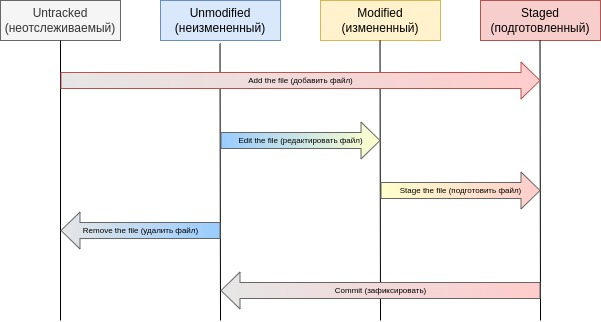

# Основы Git - Создание Git-репозитория

Если вы хотите начать работать с Git, прочитав всего одну главу, то эта глава для вас.
Здесь рассмотрены все базовые команды, необходимые вам для решения подавляющего
большенства задач, возникающих при работе с Git. После прочтения этой главы вы научитесь
настраивать и инициализировать репозиторий, начинать и прекращать контроль версий файлов,
а так же подготавливать и фиксировать изменения. Мы также продемонстрируем вам, как 
настроить в Git игнорирование отдельных файлов или их групп, как быстро и просто 
отменить ошибочные изменения, как просмотреть историю вашего проекта и изменения 
между отдельными коммитами `(commit)`, а также как отправлять `(push)` и получать
`(pull)` изменения в\из удаленного `(remote)` репозитория.

## Создание Git-репозитория

Обычно вы получаете репозиторий Git одним из двух способов:
1. Вы можете взять локальный каталог, который в настоящее время не находится под 
версионным контролем, и превратить его в репозиторий Git.
2. Вы можете **клонировать** существующий репозиторий Git из любого места.

В обеих случаях вы получите готовый к созданию Git репозиторий на вашем компьютере.

### Создание репозитория в существующем каталоге

Если у вас уже есть проект в каталоге, который не находится под версионным контролем
Git, то для начала нужно перейти в него:

```shell
$ cd git
```

а затем выполнить команду:

```shell
$ git init
```

Эта команда создает в текущем каталоге новый подкаталог с именем `.git`, содержащий
все необходимые файлы для репозитория - структуру Git репозитория. На этом этапе
ваш проект еще не находится под версионным котролем. 

Если вы хотите добавить под версионный контроль существующие файлы (в отличии
от пустого каталога), вам стоит **добавить их в индекс** и осуществить первый коммит 
изменений. Добаиться этого вы сможете запустив команду `git add` несколько раз,
указав индексируемые файлы, а затем выполнив `git commit`:

```shell
$ git add my_file.php
$ git add README.md
$ git commit -m "Initial project"
```

Или если вы хотите сразу добавить все файлы в вашем каталоге в индекс:
```shell
$ git add *
$ git commit -m "Initial project"
```

Мы разберемся что делают эти команды чуть позже. Теперь у вас есть Git-репозиторий
с отслеживаемыми файлами и начальным коммитом.

### Клонирование существующего репозитория

Для получения копии существующего Git-репозитория, например, проекта, в который 
вы хотите внести свой вклад, необходимо использовать команду `git clone`. Если вы
знакомы с другими системами контроля версий, такими как Subversion, то заметите, 
что команда называется `clone`, а не `checkout`. Это важное различие - вместо того,
чтобы просто получить рабочую копию, Git получает копию практически всех данных, 
которые есть на сервере. При выполнении `git clone` с сервера забирается `pulled`
каждая версия каждого файла из истории проекта. Файтически, если серверный диск выйдет
из строя, вы можете использовать любой из клонов на любом из клиентов, для того
чтобы вернуть сервер в состояние, в котором он находился в момент клонирования (вы 
можете потерять часть серверных хуков `server-side hooks` и т.п., но все данные,
помещенные под версионный контроль, будут сохранены.

Клонирования репозитория осуществляется с помощью команды `git clone <url>`. Например,
если вы хотите клонировать библиотеку `libgit2`, вы можете сделать это так:

```shell
$ git clone https://github.com/libgit2/libgit2
```
Эта команда создает каталог `libgit2`, инициализирует в нем подкаталог `.git`, 
скачивает все данные для этого репозитория и извлекает рабочую копию последней версии.
Если вы перейдете в только что созданный каталог `libgit2`, то увидете в нём файлы
проекта, готовые для работы или использования. Для того, чтобы клонировать репозиторий
в каталог с именем отличающимся от `libgit2`, необходимо указать желаемое имя, как
параметр командной строки:

```shell
$ git clone https://github.com/libgit2/libgit2 mylibgit 
```

Эта команда выполнит все то же самое, что и предыдущая, только результирующий каталог
будет назван `mylibgit`.

В Git реализовано несколько транспортных протоколов, которые вы сможете использовать.
В предыдущем примере использовался протокол `https://`, вы также можете встретить `git://`
или `user@server:path/to/repo.git`, использующий протокол передачи SSH.

# Основы Git - Запись изменений в репозиторий

## Запись изменений в репозиторий

Итак, у вас имеется настоящий Git-репозиторий и рабочая копия файлов для некоторого
проекта. Вам нужно делать некоторые изменения и фиксировать *снимки* состояния
`shapshots` этих изменений в вашем репозитории каждый раз, когда прооект достигает
состояния, которое вам хотелось бы сохранить.

Запомните, каждый файл в вашем рабочем каталоге может находится в одном из двух 
состояний:
1. Под версионным контролем (отслеживаемые).
2. Не под версионным контролем (неотслеживаемые).

Отслеживаемые файлы это те файлы, которые были в последнем снимке состояния проекта;
они могут быть:
1. Неизмененным.
2. Измененными.
3. Подготовленными к коммиту.

Если кратко, то **отслеживаемые файлы - это те файлы, о которых знает Git**.

Неотслеживаемые файлы - это все остальное, любые файлы в вашем рабочем каталоге,
которые не входили в ваш последний снимок состояния и не подготовлены к коммиту.
**Когда вы впервые клонируете репозиторий, все файлы будут отслеживаемыми и неизмененными**,
потому что Git только что их извлек и вы ничего пока не редактировали.

**Как только вы отредактируете файлы, Git будет рассматривать их как измененные, 
так как вы изменили их с момента последнего коммита**. Вы индексируете эти изменения,
затем фиксируете все проиндексируемые изменения, а затем цикл повторяется.

